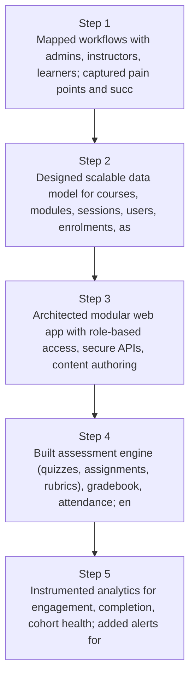
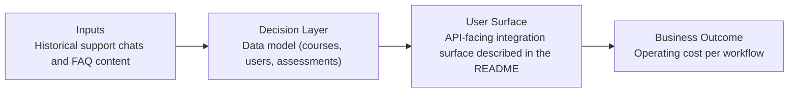
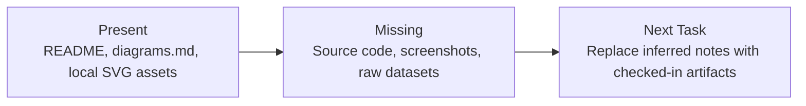

# Unified Course Management Platform Diagrams

Generated on 2026-04-26T04:29:37Z from README narrative plus project blueprint requirements.

## Platform module architecture

## Data model (courses, users, assessments)

## Evidence Gap Map

